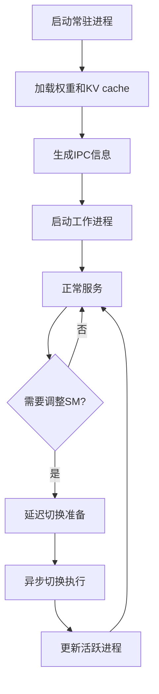

# Semi-PD 论文4.3节实现：常驻进程+进程轮转

本文档详细介绍了根据论文4.3节实现的常驻进程和进程轮转机制。

## 论文背景

根据论文 <mcreference link="https://arxiv.org/html/2504.19867?_immersive_translate_auto_translate=1" index="0">0</mcreference> 第4.3节的描述，Semi-PD面临两个主要挑战：

### 挑战1：资源调整开销
- MPS不支持调整现有进程的(x,y)配置
- 需要重新调用MPS接口，带来进程切换开销
- 包括：加载权重、复制KV cache、初始化引擎
- 切换时机的同步操作导致空闲期

### 挑战2：切换时的服务中断
- 需要等待prefill和decode worker完成当前迭代
- 切换期间到达的请求会被阻塞
- 同步操作导致早完成的worker空闲

## 解决方案实现

### 1. 常驻进程机制

#### 核心思想
> "To solve the first overhead, we introduce a resident process to consistently hold the weights and KV cache during serving, avoiding the repeated loading of weights and copying of KV cache."

#### 实现组件

**ResidentProcessManager**
```python
from sglang.semi_pd.resident_process_manager import ResidentProcessManager

# 创建常驻进程管理器
resident_manager = ResidentProcessManager(
    server_args=server_args,
    port_args=port_args,
    gpu_id=0,
    tp_rank=0,
)

# 启动常驻进程
resident_manager.start()

# 获取IPC信息用于工作进程
prefill_ipc = resident_manager.get_ipc_info_for_prefill()
decode_ipc = resident_manager.get_ipc_info_for_decode()
```

#### 关键特性
1. **持续持有资源**：权重和KV cache在服务期间始终保持在内存中
2. **IPC共享**：通过进程间通信共享内存指针给工作进程
3. **零拷贝访问**：工作进程通过指针直接访问存储，无需复制
4. **自动恢复**：监控常驻进程健康状态，异常时自动重启

### 2. 延迟切换机制

#### 核心思想
> "To hide the latency of IPC and initialization, semi-PD conducts the delayed switching, running under the new (x,y) only when the preparation step finishes."

#### 实现组件

**DelayedSwitchingController**
```python
from sglang.semi_pd.resident_process_manager import DelayedSwitchingController

# 创建延迟切换控制器
delayed_switching = DelayedSwitchingController(preparation_timeout=30.0)

# 定义准备工作回调
def preparation_callback():
    # 启动新进程，配置IPC等
    return start_new_processes_with_ipc()

# 请求延迟切换
success = delayed_switching.request_delayed_switch(preparation_callback)

# 等待准备完成
if delayed_switching.wait_for_switch_ready():
    # 执行实际切换
    perform_actual_switch()
```

#### 工作流程
1. **后台准备**：在后台线程中执行新进程启动和IPC配置
2. **隐藏延迟**：准备工作与当前服务并行进行
3. **就绪检查**：只有在准备完全完成后才执行切换
4. **超时保护**：设置准备超时，避免无限等待

### 3. 异步切换机制

#### 核心思想
> "We can renew two MPS processes directly and only kill the worker who has finished its iteration. Such an asynchronous behavior ensures there are always prefill and decode processes running in the system."

#### 实现组件

**AsynchronousSwitchingController**
```python
from sglang.semi_pd.resident_process_manager import AsynchronousSwitchingController

# 创建异步切换控制器
async_switching = AsynchronousSwitchingController()

# 为每个角色启动异步切换
for role in [InstanceRole.PREFILL, InstanceRole.DECODE]:
    success = async_switching.start_asynchronous_switch(
        role=role,
        old_process=old_processes[role],
        new_process=new_processes[role],
        iteration_complete_callback=wait_for_iteration_complete
    )

# 等待所有切换完成
for role in roles:
    async_switching.wait_for_switch_completion(role, timeout=30.0)
```

#### 关键特性
1. **独立切换**：每个角色的进程独立切换，互不影响
2. **迭代感知**：等待当前迭代完成后才终止旧进程
3. **服务连续性**：确保系统中始终有prefill和decode进程运行
4. **资源竞争**：允许MPS资源百分比临时超过100%

### 4. 集成的进程轮换管理器

#### 更新的ProcessRotationManager

```python
from sglang.semi_pd.process_rotation_manager import ProcessRotationManager
from sglang.semi_pd.resident_process_manager import SMAllocation

# 创建进程轮换管理器（集成所有机制）
rotation_manager = ProcessRotationManager(
    server_args=server_args,
    port_args=port_args,
    initial_sm_allocation=SMAllocation(prefill_percentage=70, decode_percentage=30),
    gpu_id=0,
    tp_rank=0,
)

# 启动管理器（自动启动常驻进程）
rotation_manager.start()

# 请求SM重新分配（使用延迟+异步切换）
new_allocation = SMAllocation(prefill_percentage=60, decode_percentage=40)
success = rotation_manager.request_sm_reallocation(new_allocation)

# 获取详细状态
status = rotation_manager.get_status()
print(f"常驻进程状态: {status['resident_manager']}")
print(f"延迟切换状态: {status['delayed_switching']}")
print(f"异步切换状态: {status['async_switching']}")
```

## 技术细节

### MPS资源分配机制

```python
# 设置SM百分比环境变量
os.environ["CUDA_MPS_ACTIVE_THREAD_PERCENTAGE"] = str(sm_percentage)

# 启动进程
process = mp.Process(target=worker_function, args=(...))
process.start()
```

### IPC内存共享

```python
# 常驻进程中获取IPC句柄
ipc_handle = get_ipc_handle(tensor)

# 工作进程中恢复tensor
shared_tensor = convert_ipc_handle_to_tensor(ipc_handle, size, dtype, device)
```

### 进程生命周期管理



## 性能优势

### 1. 消除重复加载开销
- **权重加载**：避免每次切换时重新加载模型权重
- **KV cache**：避免KV cache的复制开销
- **初始化时间**：减少引擎初始化时间

### 2. 隐藏切换延迟
- **并行准备**：准备工作与服务并行进行
- **零停机**：切换过程中服务不中断
- **快速响应**：准备完成后立即切换

### 3. 确保服务连续性
- **异步操作**：不同角色独立切换
- **重叠执行**：新旧进程短暂重叠运行
- **资源弹性**：支持临时资源超分配

## 使用示例

### 基本使用

```python
#!/usr/bin/env python3
"""Semi-PD 常驻进程+进程轮转示例"""

from sglang.semi_pd.process_rotation_manager import ProcessRotationManager, SMAllocation
from sglang.srt.server_args import ServerArgs, SemiPDPortArgs

def main():
    # 配置参数
    server_args = ServerArgs()
    server_args.model_path = "meta-llama/Llama-3.1-8B-Instruct"
    
    port_args = SemiPDPortArgs()
    port_args.host = "127.0.0.1"
    port_args.port = 30000
    
    # 初始SM分配
    initial_allocation = SMAllocation(prefill_percentage=70, decode_percentage=30)
    
    # 创建进程轮换管理器
    rotation_manager = ProcessRotationManager(
        server_args=server_args,
        port_args=port_args,
        initial_sm_allocation=initial_allocation,
        gpu_id=0,
        tp_rank=0,
    )
    
    try:
        # 启动管理器
        print("启动进程轮换管理器...")
        success = rotation_manager.start()
        if not success:
            print("启动失败")
            return
            
        print("管理器启动成功")
        
        # 模拟运行一段时间
        import time
        time.sleep(10)
        
        # 请求SM重新分配
        print("请求SM重新分配...")
        new_allocation = SMAllocation(prefill_percentage=60, decode_percentage=40)
        success = rotation_manager.request_sm_reallocation(new_allocation)
        
        if success:
            print("SM重新分配请求成功")
            
            # 等待切换完成
            time.sleep(5)
            
            # 检查状态
            status = rotation_manager.get_status()
            current_allocation = status["current_sm_allocation"]
            print(f"当前SM分配: P:{current_allocation['prefill_percentage']}% D:{current_allocation['decode_percentage']}%")
        else:
            print("SM重新分配请求失败")
            
    finally:
        # 停止管理器
        print("停止进程轮换管理器...")
        rotation_manager.stop()
        print("管理器已停止")

if __name__ == "__main__":
    main()
```

### 高级配置

```python
# 自定义超时配置
rotation_manager = ProcessRotationManager(
    server_args=server_args,
    port_args=port_args,
    initial_sm_allocation=initial_allocation,
    gpu_id=0,
    tp_rank=0,
)

# 访问内部组件进行高级配置
rotation_manager.delayed_switching.preparation_timeout = 60.0  # 延长准备超时
rotation_manager.resident_manager.heartbeat_interval = 3.0     # 调整心跳间隔

# 监控状态
def monitor_status():
    while True:
        status = rotation_manager.get_status()
        
        # 检查常驻进程健康状态
        resident_status = status["resident_manager"]["resident_process"]
        if resident_status and resident_status["is_alive"]:
            print(f"常驻进程运行正常 (PID: {resident_status['pid']})")
        else:
            print("⚠️ 常驻进程异常")
            
        # 检查切换状态
        if status["switch_requested"]:
            print("🔄 正在进行SM重新分配")
            
        time.sleep(5)

# 在后台线程中运行监控
import threading
monitor_thread = threading.Thread(target=monitor_status)
monitor_thread.daemon = True
monitor_thread.start()
```

## 测试验证

运行测试套件验证实现：

```bash
# 运行常驻进程管理器测试
python test/semi_pd/test_resident_process_manager.py

# 运行完整的Semi-PD测试
python test/semi_pd/test_semi_pd_features.py
```

## 故障排除

### 常见问题

1. **常驻进程启动失败**
   - 检查GPU内存是否充足
   - 确认MPS服务是否正常运行
   - 查看日志中的详细错误信息

2. **IPC通信失败**
   - 验证进程间权限设置
   - 检查共享内存限制
   - 确认CUDA上下文正确初始化

3. **切换超时**
   - 增加preparation_timeout设置
   - 检查网络和存储I/O性能
   - 监控系统资源使用情况

### 调试建议

```python
# 启用详细日志
import logging
logging.basicConfig(level=logging.DEBUG)

# 获取详细状态信息
status = rotation_manager.get_status()
print(json.dumps(status, indent=2))

# 检查进程健康状态
for role, info in status["active_processes"].items():
    print(f"{role}: PID={info['pid']}, State={info['state']}")
```

## 总结

本实现完全按照论文4.3节的描述，实现了：

1. ✅ **常驻进程机制**：持续持有权重和KV cache，避免重复加载
2. ✅ **延迟切换机制**：隐藏IPC和初始化延迟，实现零停机切换
3. ✅ **异步切换机制**：确保系统中始终有进程运行，支持资源临时超分配
4. ✅ **完整集成**：所有机制无缝集成到ProcessRotationManager中

这些机制显著减少了SM资源调整的开销，提高了系统的可用性和性能，完全符合论文的设计目标。