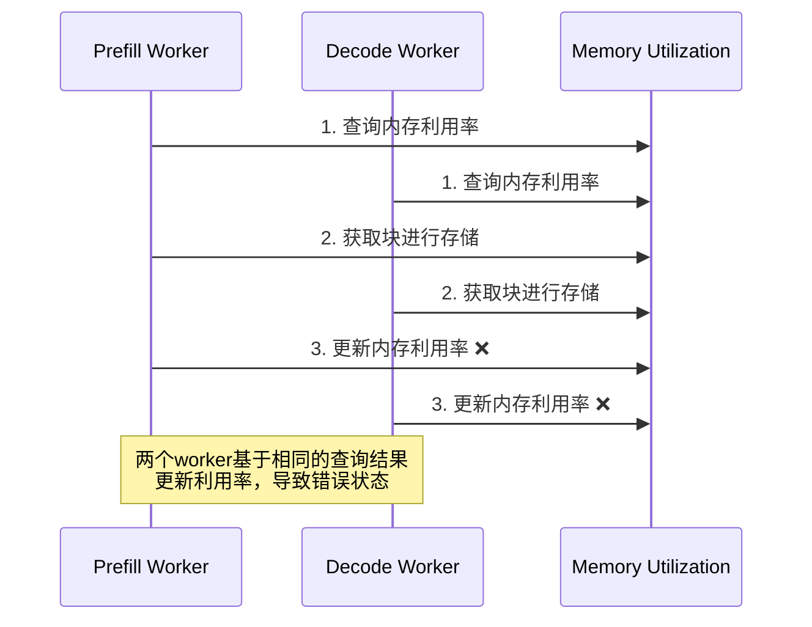

# Semi-PD Unified Memory Manager

本文档详细介绍根据论文4.4节实现的Unified Memory Manager，重点解决Semi-PD架构中的内存管理挑战。

## 论文背景

根据论文 <mcreference link="https://arxiv.org/html/2504.19867v1#S4" index="0">0</mcreference> 第4.4节，Semi-PD面临两种类型的内存访问：

### 1. 模型权重访问
- **特点**：只读访问，可以直接共享
- **挑战**：多个worker同时访问需要高效管理

### 2. KV Cache访问
- **特点**：读写访问，使用paged storage
- **挑战**：WAR (Write-After-Read) 冲突

## 核心问题：WAR冲突

论文指出，WAR冲突发生在prefill worker和decode worker异步分配KV cache时：

> "The asynchronous manner of the two workers potentially brings write-after-read (WAR) conflicts to memory management."

### WAR冲突场景



## 解决方案：原子性分配

论文提出的解决方案：

> "To address the challenge, we introduce the atomic operation for KV cache block allocating, i.e., the memory utilization is locked until the update step finishes."

### 原子性操作的三个步骤

1. **查询内存利用率**：检查是否有足够的空闲块
2. **获取块进行KV cache存储**：分配物理块
3. **更新内存利用率**：原子性更新状态

整个过程必须在锁保护下完成，确保原子性。

## 实现架构

### 核心组件

```python
class UnifiedMemoryManager:
    """统一内存管理器"""
    
    def __init__(self, total_blocks, block_size, page_size, device):
        # 内存利用率管理
        self.memory_utilization = MemoryUtilization(total_blocks)
        
        # 块管理
        self.blocks: Dict[int, BlockInfo] = {}
        self.free_block_ids: Set[int] = set(range(total_blocks))
        
        # 页表管理（vLLM风格）
        self.page_tables: Dict[str, Dict[int, List[PageTableEntry]]] = {}
        
        # 同步控制 - 解决WAR冲突的关键
        self.allocation_lock = threading.RLock()
        self.access_lock = threading.RLock()
        self.page_table_lock = threading.RLock()
```

### 内存利用率管理

```python
class MemoryUtilization:
    """内存利用率管理 - 解决WAR冲突的核心"""
    
    def __init__(self, total_blocks: int):
        self.total_blocks = total_blocks
        self.allocated_blocks = 0
        self.free_blocks = total_blocks
        
        # 原子操作锁 - 解决WAR冲突
        self._lock = threading.RLock()
        
    def atomic_allocate(self, num_blocks: int) -> bool:
        """原子性分配（解决WAR冲突）"""
        with self._lock:
            if self.free_blocks >= num_blocks:
                self.free_blocks -= num_blocks
                self.allocated_blocks += num_blocks
                return True
            return False
```

## 关键功能实现

### 1. 模型权重管理（只读访问）

```python
def register_model_weights(self, weight_name: str, weight_tensor: torch.Tensor) -> bool:
    """注册模型权重（只读访问）"""
    # 模型权重是只读的，可以直接共享
    self.model_weights[weight_name] = weight_tensor
    self.weight_access_count[weight_name] = 0
    return True

def get_model_weights(self, weight_name: str) -> Optional[torch.Tensor]:
    """获取模型权重（只读访问）"""
    if weight_name in self.model_weights:
        self.weight_access_count[weight_name] += 1
        return self.model_weights[weight_name]
    return None
```

**特点**：
- 只读访问，无需复杂同步
- 支持多个worker并发访问
- 自动统计访问次数

### 2. KV Cache原子性分配

```python
def allocate_kv_cache_blocks(
    self,
    request_id: str,
    layer_id: int,
    num_blocks: int,
    requester_role: InstanceRole,
) -> Optional[List[int]]:
    """
    分配KV cache块（原子性操作，解决WAR冲突）
    
    根据论文4.4节的三步原子操作：
    1. 查询内存利用率
    2. 获取块进行KV cache存储  
    3. 更新内存利用率
    """
    # 原子性分配 - 解决WAR冲突的核心
    with self.allocation_lock:
        # 第一步：查询内存利用率
        utilization = self.memory_utilization.query_utilization()
        
        if utilization["free_blocks"] < num_blocks:
            return None
        
        # 第二步：获取块进行KV cache存储
        allocated_block_ids = []
        free_blocks_list = list(self.free_block_ids)
        
        for i in range(num_blocks):
            block_id = free_blocks_list[i]
            allocated_block_ids.append(block_id)
            
            # 更新块状态
            self.blocks[block_id].state = BlockState.ALLOCATED
            self.blocks[block_id].request_id = request_id
            self.blocks[block_id].layer_id = layer_id
            self.blocks[block_id].allocator_role = requester_role
            
            self.free_block_ids.remove(block_id)
        
        # 第三步：原子性更新内存利用率
        success = self.memory_utilization.atomic_allocate(num_blocks)
        if not success:
            # 回滚分配
            self._rollback_allocation(allocated_block_ids)
            return None
        
        # 创建页表项
        self._create_page_table_entries(request_id, layer_id, allocated_block_ids)
        
        return allocated_block_ids
```

**关键特性**：
- **原子性**：整个分配过程在锁保护下完成
- **一致性**：失败时自动回滚，保持状态一致
- **并发安全**：多个worker可以安全并发分配
- **角色感知**：记录分配者角色，便于冲突检测

### 3. vLLM风格的Paged Storage

```python
def _create_page_table_entries(
    self, 
    request_id: str, 
    layer_id: int, 
    block_ids: List[int]
):
    """创建页表项（vLLM风格的paged storage）"""
    with self.page_table_lock:
        if request_id not in self.page_tables:
            self.page_tables[request_id] = {}
            
        if layer_id not in self.page_tables[request_id]:
            self.page_tables[request_id][layer_id] = []
            
        # 为每个块创建页表项
        for i, block_id in enumerate(block_ids):
            entry = PageTableEntry(
                virtual_page_id=i,
                physical_block_id=block_id,
                request_id=request_id,
                layer_id=layer_id,
            )
            self.page_tables[request_id][layer_id].append(entry)

def get_block_table_index(
    self, 
    request_id: str, 
    layer_id: int
) -> Optional[List[int]]:
    """
    获取块表索引（vLLM风格）
    
    根据论文："Once the block table index is determined, 
    the access of the KV cache can be conducted without conflicts."
    """
    with self.page_table_lock:
        if (request_id in self.page_tables and 
            layer_id in self.page_tables[request_id]):
            
            entries = self.page_tables[request_id][layer_id]
            return [entry.physical_block_id for entry in entries if entry.is_valid]
        return None
```

**特点**：
- **页表映射**：虚拟页到物理块的映射
- **层级管理**：每个请求的每一层独立管理
- **无冲突访问**：通过块表索引确定后，访问无冲突

### 4. WAR冲突检测

```python
def detect_war_conflicts(self) -> List[Dict]:
    """检测潜在的WAR冲突"""
    conflicts = []
    
    # 检查同时访问相同块的不同角色
    block_access_map: Dict[int, List[InstanceRole]] = {}
    
    for request_id, block_ids in self.allocated_blocks.items():
        for block_id in block_ids:
            if block_id in self.blocks:
                role = self.blocks[block_id].allocator_role
                if role:
                    if block_id not in block_access_map:
                        block_access_map[block_id] = []
                    block_access_map[block_id].append(role)
                    
    # 查找冲突
    for block_id, roles in block_access_map.items():
        unique_roles = set(roles)
        if len(unique_roles) > 1 and InstanceRole.PREFILL in unique_roles and InstanceRole.DECODE in unique_roles:
            conflicts.append({
                "block_id": block_id,
                "conflicting_roles": list(unique_roles),
                "conflict_type": "WAR",
                "description": "Prefill and decode workers accessing same block"
            })
            
    return conflicts
```

## 使用示例

### 基本使用

```python
from sglang.semi_pd.unified_memory_manager import UnifiedMemoryManager
from sglang.semi_pd.utils import InstanceRole

# 创建统一内存管理器
memory_manager = UnifiedMemoryManager(
    total_blocks=1000,
    block_size=4096,
    page_size=16,
    device=torch.device("cuda"),
)

# 1. 注册模型权重
weight_tensor = torch.randn(4096, 4096, dtype=torch.float16)
memory_manager.register_model_weights("layer1.weight", weight_tensor)

# 2. 获取模型权重（只读访问）
weight = memory_manager.get_model_weights("layer1.weight")

# 3. 分配KV cache块
block_ids = memory_manager.allocate_kv_cache_blocks(
    request_id="req_1",
    layer_id=0,
    num_blocks=10,
    requester_role=InstanceRole.PREFILL,
)

# 4. 获取块表索引
block_indices = memory_manager.get_block_table_index("req_1", 0)

# 5. 访问KV cache
kv_tensors = memory_manager.access_kv_cache(
    request_id="req_1",
    layer_id=0,
    accessor_role=InstanceRole.PREFILL,
)

# 6. 释放KV cache块
memory_manager.deallocate_kv_cache_blocks("req_1")
```

### 并发访问示例

```python
import threading
from concurrent.futures import ThreadPoolExecutor

def concurrent_allocator(worker_id, role):
    """并发分配器 - 模拟WAR冲突场景"""
    results = []
    
    for i in range(5):
        block_ids = memory_manager.allocate_kv_cache_blocks(
            request_id=f"{role.name}_req_{worker_id}_{i}",
            layer_id=0,
            num_blocks=4,
            requester_role=role,
        )
        results.append(block_ids is not None)
        
    return results

# 启动多个并发worker
with ThreadPoolExecutor(max_workers=8) as executor:
    futures = []
    
    # 4个prefill worker
    for i in range(4):
        future = executor.submit(concurrent_allocator, i, InstanceRole.PREFILL)
        futures.append(future)
        
    # 4个decode worker  
    for i in range(4):
        future = executor.submit(concurrent_allocator, i, InstanceRole.DECODE)
        futures.append(future)
        
    # 收集结果
    results = [future.result() for future in futures]

# 检查WAR冲突
conflicts = memory_manager.detect_war_conflicts()
print(f"检测到 {len(conflicts)} 个WAR冲突")
```

## 性能优化

### 1. 锁粒度优化

```python
# 使用不同的锁来减少竞争
self.allocation_lock = threading.RLock()  # 分配操作
self.access_lock = threading.RLock()      # 访问操作  
self.page_table_lock = threading.RLock()  # 页表操作
```

### 2. 内存预分配

```python
# 预分配块池，减少运行时分配开销
def _initialize_blocks(self):
    for block_id in range(self.total_blocks):
        self.blocks[block_id] = BlockInfo(
            block_id=block_id,
            state=BlockState.FREE,
        )
```

### 3. 批量操作

```python
def allocate_multiple_layers(
    self,
    request_id: str,
    layer_configs: List[Tuple[int, int]],  # (layer_id, num_blocks)
    requester_role: InstanceRole,
) -> Dict[int, List[int]]:
    """批量分配多个层的KV cache"""
    with self.allocation_lock:
        # 批量分配，减少锁竞争
        results = {}
        for layer_id, num_blocks in layer_configs:
            block_ids = self._allocate_blocks_internal(
                request_id, layer_id, num_blocks, requester_role
            )
            if block_ids:
                results[layer_id] = block_ids
            else:
                # 失败时回滚所有已分配的层
                for allocated_layer_id in results:
                    self._deallocate_blocks_internal(request_id, allocated_layer_id)
                return {}
        return results
```

## 监控和调试

### 内存使用监控

```python
# 获取内存使用情况
usage = memory_manager.get_memory_usage()
print(f"利用率: {usage['utilization_ratio']:.1%}")
print(f"已分配: {usage['allocated_blocks']} 块")
print(f"空闲: {usage['free_blocks']} 块")

# 获取详细统计
stats = memory_manager.get_statistics()
print(f"总分配次数: {stats['total_allocations']}")
print(f"分配失败次数: {stats['allocation_failures']}")
print(f"平均分配时间: {stats['avg_allocation_time']:.4f}s")
```

### WAR冲突监控

```python
# 检测WAR冲突
conflicts = memory_manager.detect_war_conflicts()
for conflict in conflicts:
    print(f"冲突块 {conflict['block_id']}: {conflict['description']}")
    
# 监控分配模式
def monitor_allocation_patterns():
    while True:
        stats = memory_manager.get_statistics()
        usage = memory_manager.get_memory_usage()
        
        print(f"利用率: {usage['utilization_ratio']:.1%}, "
              f"分配失败率: {stats['allocation_failures']/max(1, stats['total_allocations']):.1%}")
              
        time.sleep(5)
```

## 故障排除

### 常见问题

1. **分配失败率高**
   - 检查总块数是否足够
   - 监控内存碎片情况
   - 考虑增加垃圾回收频率

2. **WAR冲突频繁**
   - 检查并发访问模式
   - 优化分配策略
   - 考虑增加块池大小

3. **性能瓶颈**
   - 分析锁竞争情况
   - 优化批量操作
   - 考虑使用无锁数据结构

### 调试工具

```python
# 启用调试模式
memory_manager.debug_mode = True

# 详细日志
import logging
logging.getLogger('sglang.semi_pd.unified_memory_manager').setLevel(logging.DEBUG)

# 状态转储
def dump_manager_state():
    status = memory_manager.get_status()
    
    print("=== Memory Manager State ===")
    print(f"Configuration: {status['configuration']}")
    print(f"Memory Usage: {status['memory_usage']}")
    print(f"Statistics: {status['statistics']}")
    print(f"WAR Conflicts: {status['war_conflicts']}")
```

## 与现有系统集成

### 集成到Semi-PD Scheduler

```python
class SemiPDSchedulerWithUnifiedMemory(Scheduler):
    def __init__(self, *args, **kwargs):
        super().__init__(*args, **kwargs)
        
        # 创建统一内存管理器
        self.unified_memory = UnifiedMemoryManager(
            total_blocks=self.max_total_num_tokens // 16,
            block_size=4096,
            page_size=16,
            device=self.device,
        )
        
    def allocate_kv_cache(self, req):
        """使用统一内存管理器分配KV cache"""
        return self.unified_memory.allocate_kv_cache_blocks(
            request_id=req.rid,
            layer_id=0,  # 简化示例
            num_blocks=req.num_blocks_needed,
            requester_role=self.instance_role,
        )
```

### 与现有KV Cache系统兼容

```python
class UnifiedMemoryKVCache(KVCache):
    """兼容现有KV Cache接口的统一内存管理器"""
    
    def __init__(self, unified_memory_manager):
        self.unified_memory = unified_memory_manager
        
    def get_kv_buffer(self, layer_id: int):
        # 适配现有接口
        return self.unified_memory.get_layer_kv_buffer(layer_id)
        
    def set_kv_buffer(self, layer, loc, cache_k, cache_v):
        # 适配现有接口
        return self.unified_memory.set_layer_kv_buffer(
            layer.layer_id, loc, cache_k, cache_v
        )
```

## 总结

本实现完全按照论文4.4节的设计，解决了Semi-PD架构中的关键内存管理挑战：

1. ✅ **模型权重只读访问**：高效的共享访问机制
2. ✅ **KV Cache paged storage**：vLLM风格的页表管理
3. ✅ **WAR冲突解决**：原子性分配操作
4. ✅ **并发安全**：多级锁保护机制
5. ✅ **性能优化**：批量操作和预分配
6. ✅ **监控调试**：完整的状态监控和冲突检测

这套实现为Semi-PD提供了可靠、高效的统一内存管理能力，确保了prefill和decode worker的安全并发访问。